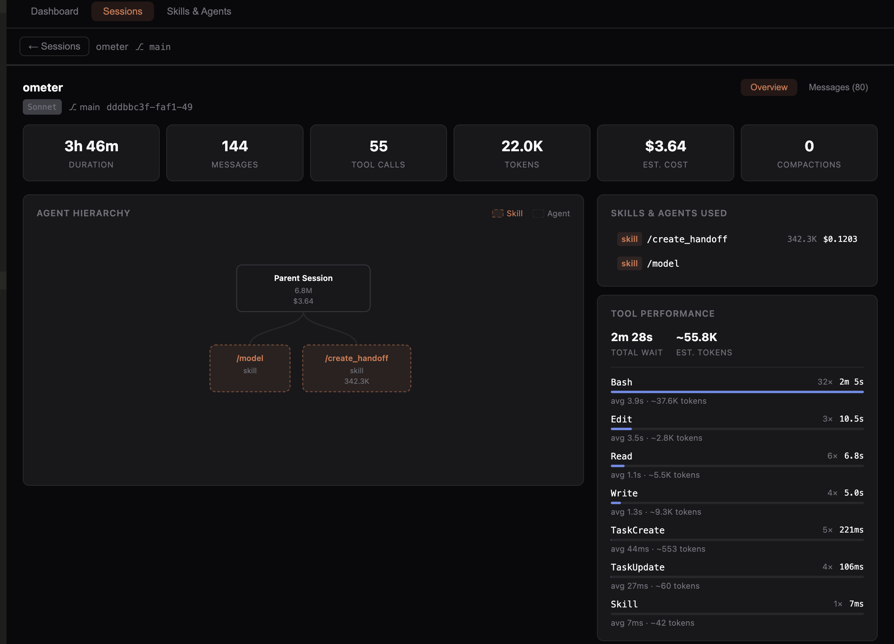
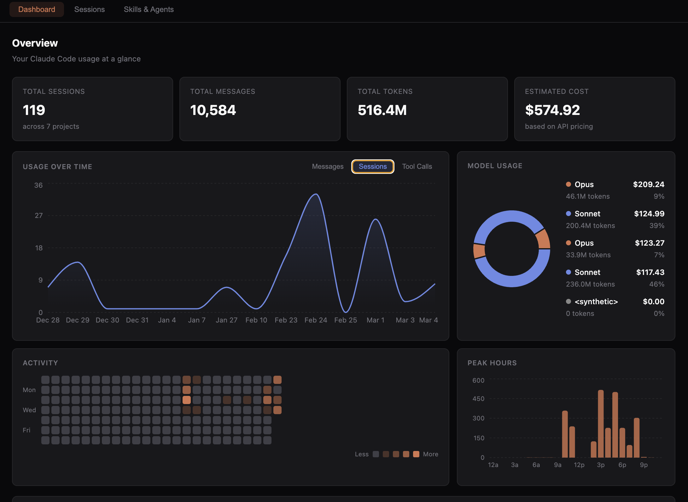
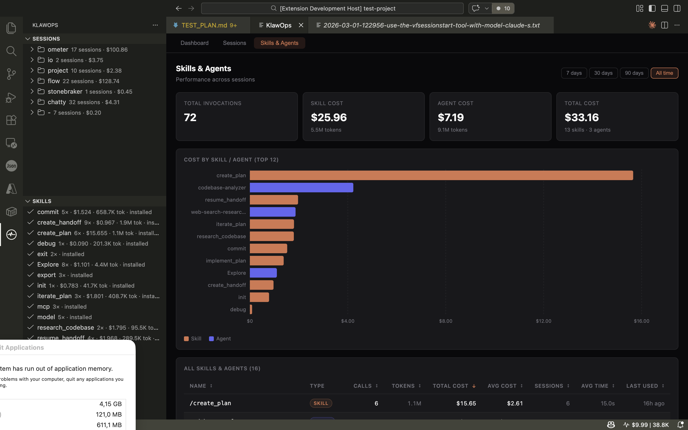
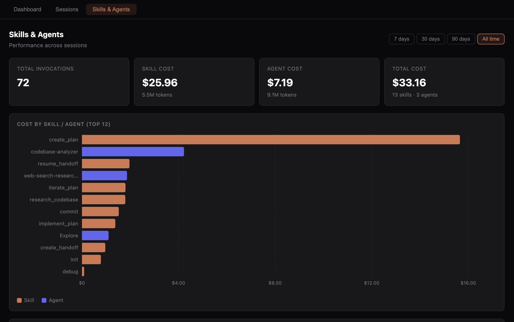
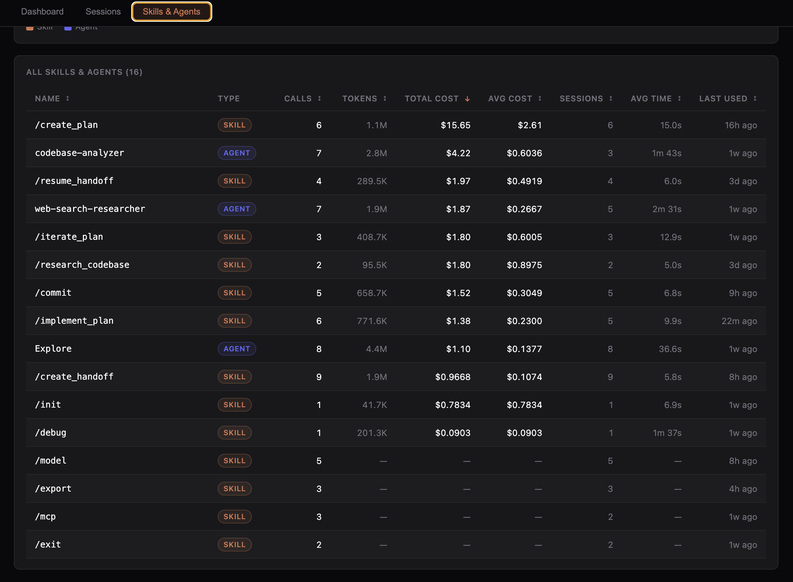
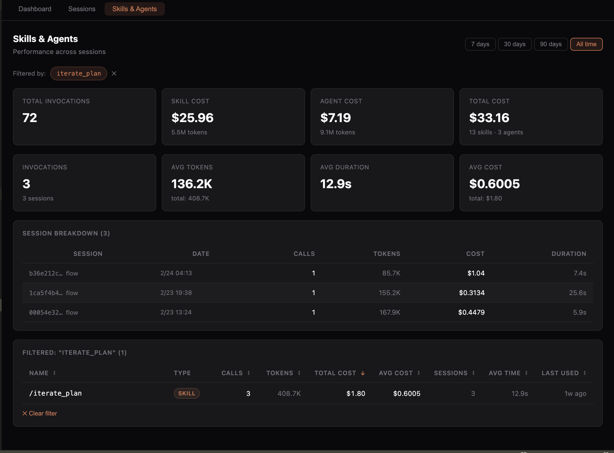

# KlawOps

**Claude Code session analytics, cost tracking, and AI workflow skills — right inside VS Code.**

KlawOps reads your `~/.claude/` directory directly. No server, no database, no cloud sync. Everything stays local.

---

## Features

### Live Cost Tracker (Status Bar)

The status bar shows the **cost and token count** of your most recent Claude Code session, updating in real time as Claude writes to its session files.

```
⎍ $0.42 | 284K
```

Click the status bar item to open the Analytics Dashboard.

---

### Session Browser (Sidebar)

Browse all your Claude Code projects and sessions in a tree view. Sessions are organised by project and sorted by recency.

- Project nodes show session count and total cost
- Session nodes show per-session cost and message count
- Click any session to open a **conversation replay panel**

The conversation replay shows:
- Header stat grid: duration, messages, tool calls, tokens, cost, compactions
- Full message history with role icons, timestamps, model badges, and per-turn token usage
- Tool call badges inline with assistant messages
- Right sidebar: token breakdown, tools used, context compaction timeline, session metadata



---

### Analytics Dashboard

Open via **Ctrl+Shift+P → KlawOps: Open Dashboard** (or click the status bar).

The dashboard shows:
- **Stat cards**: total sessions, messages, tokens, and estimated cost
- **Usage Over Time** — area chart with Messages / Sessions / Tool Calls toggle
- **Model Usage** — donut chart breaking down tokens and cost by model
- **Activity Heatmap** — GitHub-style contribution grid (24 weeks)
- **Peak Hours** — bar chart of your most productive hours
- **Recent Sessions** — clickable table that opens conversation replay



The dashboard updates automatically when a new Claude session is written.

#### Skills & Agents Analytics

The **Skills & Agents** tab tracks every `/skill` and sub-agent invocation across your sessions — cost, token usage, call count, average duration, and last used.







Click any row to filter the view to that skill or agent.



---

### Skills Panel (Sidebar)

KlawOps bundles four **AI workflow commands** and four **sub-agents** designed for use with Claude Code. Install them with one click.

**Commands** (invoke with `/` in Claude Code):
| Command | What it does |
|---------|-------------|
| `/research_codebase_generic` | Comprehensive codebase research via parallel sub-agents |
| `/create_plan_generic` | Interactive implementation planning with codebase context |
| `/implement_plan` | Phase-by-phase plan execution with verification checkpoints |
| `/validate_plan` | Post-implementation validation against plan success criteria |

**Agents** (used automatically by the commands above):
- `codebase-analyzer` — traces data flow and explains implementation details
- `codebase-locator` — finds files and directories by topic
- `codebase-pattern-finder` — extracts concrete code examples for modelling
- `web-search-researcher` — researches modern APIs and libraries on the web

Each skill shows an install status icon (`✓` installed / `↓` not installed). Use the **Install** or **Install All Skills** button to copy skills to your chosen scope.

---

## Installation

### Quick Install (Recommended)

```bash
curl -fsSL https://raw.githubusercontent.com/TassanSaidi/KlawOps/main/install.sh | bash
```

This installs:
- The KlawOps VS Code extension
- 4 Claude Code commands (`/research_codebase_generic`, `/create_plan_generic`, `/implement_plan`, `/validate_plan`)
- 4 Claude Code agents (`codebase-analyzer`, `codebase-locator`, `codebase-pattern-finder`, `web-search-researcher`)

> Skills are copied to `~/.claude/commands/` and `~/.claude/agents/`. **Existing files are never overwritten.**

### Manual Install

Download `klawops-<version>.vsix` from the [Releases](https://github.com/TassanSaidi/KlawOps/releases) page, then:

```bash
code --install-extension klawops-0.1.0.vsix
```

Or via VS Code: **Extensions → ⋯ → Install from VSIX…**

### Uninstall

```bash
# Download first (do not pipe — the script prompts for confirmation)
curl -fsSL https://raw.githubusercontent.com/TassanSaidi/KlawOps/main/uninstall.sh -o uninstall.sh
bash uninstall.sh
```

---

## Getting Started

1. Open any project in VS Code — KlawOps activates automatically on startup
2. Click the **⎍** icon in the Activity Bar to open the KlawOps sidebar
3. Start a Claude Code session in your terminal — the status bar updates within seconds
4. Browse sessions in the **Sessions** tree, or open the **Dashboard** for aggregate stats

### Install Workflow Skills

On first activation, KlawOps offers to install the bundled skills globally. You can also install them at any time from the **Skills** panel:

- **Global** (`~/.claude/commands/` and `~/.claude/agents/`) — available in all projects
- **Workspace** (`.claude/commands/` and `.claude/agents/`) — available in this project only

After installing, use them in Claude Code:
```
/research_codebase_generic
→ "How does authentication work in this codebase?"

/create_plan_generic
→ "Add rate limiting to the API"

/implement_plan plans/2025-01-08-rate-limiting.md

/validate_plan plans/2025-01-08-rate-limiting.md
```

---

## Configuration

| Setting | Default | Description |
|---------|---------|-------------|
| `klawops.claudeDir` | `~/.claude` | Override the path to your Claude data directory |

---

## Privacy

KlawOps reads only files in `~/.claude/` (or your configured override path). It does **not** send any data to external servers, collect telemetry, or require authentication.

---

## Requirements

- VS Code 1.85 or later
- [Claude Code](https://claude.ai/code) CLI installed and used at least once

---

## License

MIT
